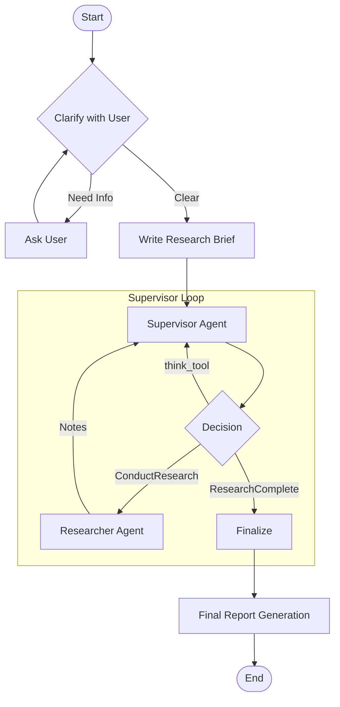

# Deep Research Agent Workflow

This document outlines the workflow of the Deep Research Agent system. The system is designed to perform autonomous, multi-agent research based on a user's prompt.

## High-Level Overview

The system follows a hierarchical multi-agent architecture implemented using **LangGraph**. The workflow progresses through four main phases:

1.  **Scope & Clarification**: Understanding the user's request.
2.  **Supervision**: orchestrating the research process.
3.  **Execution**: Performing deep web searches and analysis.
4.  **Reporting**: Synthesizing findings into a final report.

## Detailed Workflow Steps

### 1. Initialization & Scoping (`deep_research.agents.research_scope`)

The process begins in `research_full.py`, which initializes the `deep_researcher` graph.

*   **`clarify_with_user`**:
    *   **Input**: User's initial prompt.
    *   **Action**: Uses an LLM to determine if the request is specific enough.
    *   **Logic**:
        *   If vague: Returns a clarification question. The workflow pauses here until the user responds.
        *   If clear: Proceeds to the next step.
*   **`write_research_brief`**:
    *   **Action**: Synthesizes the conversation history into a formal **Research Brief** and a set of initial **Research Questions**.
    *   **Output**: A structured `research_brief` string passed to the Supervisor.

### 2. The Supervisor (`deep_research.agents.supervisor`)

The Supervisor is the orchestrator. it maintains the state of the research and delegates tasks.

*   **`supervisor` Node**:
    *   Analyzes the specific `research_brief` and current `notes`.
    *   Decides on the next best action using `supervisor_tools`.
*   **`supervisor_tools` Node**:
    *   **`think_tool`**: Used for internal reasoning and strategy refinement.
    *   **`ConductResearch`**: Launches a **Researcher Agent**.
        *   This can happen in parallel (up to `max_concurrent_researchers`).
    *   **`ResearchComplete`**: Ends the research phase when sufficient information is gathered.

### 3. The Researcher (`deep_research.agents.research`)

When the Supervisor calls `ConductResearch(topic)`, a sub-graph is triggered for that specific topic.

*   **`llm_call`**: 
    *   The agent analyzes the specific topic.
    *   Decides to use `tavily_search` to find identifying information.
*   **`tool_node`**:
    *   Executes the web search key-values.
*   **Loop**:
    *   The agent loops between reasoning and searching until it has enough information.
*   **`compress_research`**:
    *   Once finished, the agent summarizes all its findings into a concise note.
    *   **Output**: Compressed notes are returned to the Supervisor.

### 4. Final Reporting (`deep_research.agents.research_full`)

Once the Supervisor decides the research is complete:

*   **`final_report_generation`**:
    *   **Input**: The original `research_brief` and all accumulated `notes` from the researchers.
    *   **Action**: A specialized writer model compiles a comprehensive markdown report.
    *   **Output**: The final research report.

## File Structure Mapping

*   **Entry Point**: `src/deep_research/agents/research_full.py` - Connects the high-level nodes.
*   **Scoping**: `src/deep_research/agents/research_scope.py` - User interaction and brief creation.
*   **Orchestrator**: `src/deep_research/agents/supervisor.py` - The "manager" logic.
*   **Worker**: `src/deep_research/agents/research.py` - The "worker" logic (web search).
*   **State**: `src/deep_research/state/` - Type definitions for the data flowing between agents.
